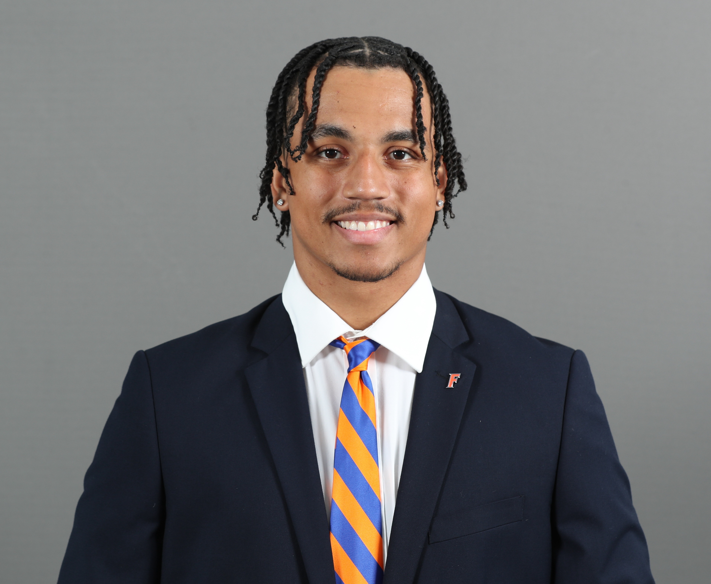

  

### Data Scientist | Former Division I Athlete
*Fort Lauderdale, FL | (954) 856-9486 | ethmwn@gmail.com*

  &nbsp;
  &nbsp;
  &nbsp;
  

---

## 📖 About Me

I am a Master’s graduate in Information Systems & Operations Management (Data Science focus) with a background in building end-to-end machine learning pipelines. My expertise lies in converting raw, messy data into actionable competitive advantages.

I thrive in high-stakes environments where precision, efficiency, and speed are the difference between winning and losing.

---

## 🎓 Education

**University of Florida** | *Gainesville, FL*
**Master of Science, Information Systems and Operations Management**
* **Specialization:** Data Science
* **Graduated:** December 2025

**University of Florida** | *Gainesville, FL*
**Bachelor of Arts, Business Administration & Computer Information Science**
* **Minor:** Computer Information Science & Engineering
* **Graduated:** May 2024

---

## 📂 Featured Projects

### [NFL Run/Pass Prediction Engine ("Virtual Defensive Coordinator")](https://github.com/mixedethan/run-pass-predictions)
*Python, LightGBM, Streamlit*

A machine learning application designed to act as a Virtual Defensive Coordinator. It predicts whether an offense will Run or Pass, and whether they will "Go for it" on 4th Down based on game context.

* **Modeling:** Built a time-series validated "Cascade" LightGBM pipeline to predict offensive play-calling and 4th down decisions.
* **Performance:** Achieved **70% accuracy**, outperforming the positional baseline by 12%.
* **Deployment:** Deployed an interactive **Streamlit** web app allowing users to simulate "Defensive Coordinator" situations with live probability calibration.

[FourthDown.io Streamlit App](https://fourthdownio.streamlit.app)

### [Predicting CFB Wins 2025](https://github.com/mixedethan/predicting-cfb-wins-2025)
*Python, Scikit-Learn, Web Scraping (BeautifulSoup)*

A predictive modeling project forecasting College Football season outcomes using "Net Efficiency" metrics rather than simple win/loss records.

* **ETL Pipeline:** Built a robust automated pipeline using **BeautifulSoup** to scrape 9 years of team statistics from *cfbstats.com*, extracting 50+ raw metrics.
* **Analysis:** Engineered "Net Efficiency" features to train and tune Random Forest, Ridge, and Linear regression models that predict season Win %.

---

## 💼 Professional Experience

### Data Science & Machine Learning Intern | [**Aroapp.ai**](aroapp.ai)
*Miami, FL (Remote) | July 2025 – Dec 2025*
* Developed an end-to-end **MLOps pipeline** to automatically generate, score, and refine event recommendations for 575 clients, reducing manual ideation time by **60%**.
* Implemented **NLP** techniques for feature extraction, utilizing **spaCy** for part-of-speech tagging and **sentence-transformers** to create embeddings for clustering.
* Segmented clients into actionable archetypes by applying a **K-Prototypes clustering** algorithm to mixed encoded data types, then leveraged an LLM to automatically generate descriptive profiles for each cluster.

### Sales Operations Analyst Intern | **Dexian**
*Orlando, FL | May 2024 – June 2024*
* Engineered **SQL** queries to extract raw CRM/ATS data, identifying bottlenecks within the candidate qualification workflow to improve pipeline efficiency.
* Designed and deployed interactive **Tableau** dashboards for the 12-person sales team, enabling real-time tracking of KPIs including daily spread, fill rates, and lead time.
* Modeled historical recruitment data using Python (Pandas) and Excel to aggregate strategic findings into a final presentation for executive leadership.

### Scholar-Athlete, Defensive Back | **Florida Gators Football** 🐊
*Gainesville, FL | August 2023 – January 2025*
* Participated in Division I Football at the Univeristy of Florida as a defensive back.
* Managed a 25+ hour weekly D1 athletic schedule consisting of maintaining full-time STEM graduate
coursework and completing 20+ hours of professional development annually.

### Lead Student Housing Leasing Agent | **Landmark Properties Inc.** 
*Gainesville, FL | August 2021 – December 2025*
* Cultivated strong relationships with over 830 current and prospective residents, enhancing satisfaction and
fostering community engagement
* Implemented workflow improvements that reduced communication response time with prospective residents by
12%, directly enhancing operational efficiency.
* Train, supervise, and mentor community ambassadors to develop their leasing and prospecting acumen and
communication skills.
  

---

## 📬 Contact

I am currently open to Data Science and Analyst opportunities.

* **Email:** [ethmwn@gmail.com](mailto:ethmwn@gmail.com)
* **LinkedIn:** [linkedin.com/in/ethan---wilson/](https://www.linkedin.com/in/ethan---wilson/)
* **GitHub:** [github.com/mixedethan](https://github.com/mixedethan)
